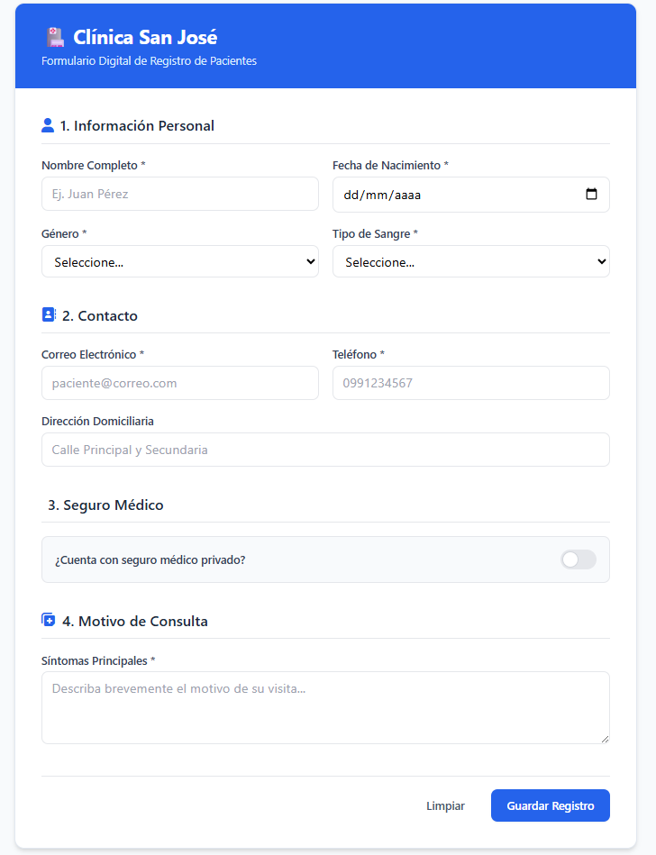

#  Rediseño de Entradas Efectivas – Formulario de Admisiones
> **Clínica San José** | Optimización del sistema de registro de pacientes para reducir tiempos y eliminar errores de captura[cite: 1, 2].

---

##  Datos del Proyecto
* **Integrantes:** Diego Loor
* **Entregable:** Repositorio GitHub con diseño digital + README.md[cite: 1]

---

##  Contexto del Caso
El departamento de Admisiones de la **Clínica San José** requería optimizar su proceso de registro[cite: 1, 2]. El formulario legacy anterior generaba cuellos de botella por pérdida de información al recargar tras un error, captura ineficiente de fechas/teléfonos sin validación, redundancia de campos (ej. solicitar edad y fecha de nacimiento a la vez) y confusión visual al mostrar datos irrelevantes (como el representante legal en personas adultas)[cite: 1, 2].

---

## Paso 1: Análisis de Deficiencias y Selección de Controles

### 1. Deficiencia 1: Redundancia y captura ineficiente en Fechas y Edad
* **Descripción del problema:** Solicitaba escribir manualmente tanto la `FECHA DE NACIMIENTO` (dd/mm/aaaa) como la `EDAD` en un campo de texto[cite: 2]. Esto generaba datos inconsistentes o errores de cálculo[cite: 1, 2]. Además, se pedía escribir manualmente la fecha y hora de ingreso[cite: 2].
* **Control propuesto y justificación:** 
  * Se implementa un **Datepicker (selector de fecha)** estandarizado para la fecha de nacimiento[cite: 1].
  * La **Edad** se calcula automáticamente en el backend/frontend a partir de la fecha seleccionada (campo autocompletado)[cite: 1, 2].
  * La **Fecha y Hora de Ingreso** se capturan automáticamente usando la fecha y hora del sistema (`timestamp` por defecto)[cite: 2].

### 2. Deficiencia 2: Opciones de selección abiertas mediante campos de texto plano
* **Descripción del problema:** Campos como `GÉNERO`, `TIPO DE SANGRE` y `¿TIENE SEGURO MÉDICO?` exigían escribir manualmente las opciones ("F", "M", "A+", "SI", "NO")[cite: 2]. Esto ocasionaba errores tipográficos, variaciones de minúsculas/mayúsculas y bloqueaba la base de datos[cite: 1, 2].
* **Control propuesto y justificación:**
  * **Toggle Switch / Segmented Control:** Para `¿Tiene seguro médico?` (Sí / No)[cite: 1].
  * **Select / Dropdown:** Para `Género` (Femenino, Masculino, Otro) y `Tipo de Sangre` (A+, A-, B+, B-, AB+, AB-, O+, O-), garantizando la integridad de datos[cite: 1].

### 3. Deficiencia 3: Sobrecarga cognitiva por falta de campos condicionales
* **Descripción del problema:** Los campos de `REPRESENTANTE LEGAL` y `PÓLIZA DE SEGURO` se mostraban siempre obligatorios para todos los pacientes[cite: 2]. Un paciente adulto sin seguro debía escribir manualmente "NO TIENE" o "-" para continuar[cite: 2].
* **Control propuesto y justificación:**
  * **Lógica Condicional (Campos Dinámicos):** Los campos del representante legal permanecen **ocultos** y solo se despliegan automáticamente si el cálculo de la edad es menor a 18 años[cite: 1, 2].
  * Los campos de **Aseguradora y Póliza** solo se muestran si el Toggle Switch de `¿Tiene seguro médico?` se activa en `SÍ`[cite: 1, 2].

---

##  Paso 2: Tabla de Respuesta a Eventos (Event-Response Table)

La siguiente tabla documenta la retroalimentación en tiempo real (*inline validation*) y el comportamiento dinámico de la interfaz ante las interacciones del usuario[cite: 1]:

| Evento del Usuario | Acción del Sistema | Feedback Visual en Pantalla | Feedback Textual (Mensajes) |
| :--- | :--- | :--- | :--- |
| **Selección de Fecha de Nacimiento** | Calcula la edad exacta. Si es `< 18`, habilita sección de Representante Legal[cite: 2]. | Bordes verdes en fecha. Despliegue animado (*fade-in*) de los campos del tutor[cite: 2]. | *"Paciente menor de edad. Complete los datos del representante legal."*[cite: 2] |
| **Cambio en Toggle "Tiene Seguro Médico"** | Si se marca **SÍ**, renderiza los campos de `Aseguradora` y `N° Póliza`[cite: 2]. | Transición suave que muestra las entradas adicionales. | *"Ingrese los datos de su cobertura médica."* |
| **Escribir Correo Electrónico (blur / al escribir)** | Valida la estructura mediante Expresión Regular (`Regex`)[cite: 2]. | Borde rojo en el input e icono de advertencia (⚠️) si el formato es inválido[cite: 2]. | *"Por favor, ingrese un correo válido (ej: usuario@dominio.com)."*[cite: 2] |
| **Escribir Teléfono** | Aplica máscara numérica `(XXX-XXX-XXXX)` y restringe caracteres alfabéticos[cite: 2]. | Borde verde al completar los dígitos requeridos. | *"Formato telefónico correcto."* |
| **Click en "Guardar / Registrar" con campos vacíos** | Detiene el envío, enfoca (*focus*) el primer campo inválido y conserva la data previa en memoria[cite: 1, 2]. | Los campos requeridos sin llenar se resaltan en rojo con una leve animación de vibración (*shake*). | *"Por favor completa los campos requeridos antes de continuar."* |

---

##  Paso 3: Justificación Teórica del Diseño

### 1. Modelo Conceptual de la Entrada
* **Información (Qué capturar):**
  * **Eliminados / Automatizados:** Se eliminó la digitación manual del ID de paciente y la fecha/hora de ingreso (automatizados con el sistema)[cite: 2].
  * **Reorganizados:** Se estructuraron los campos en bloques lógicos claros para evitar la confusión visual del sistema anterior[cite: 1, 2].
* **Presentación (Cómo capturar):**
  * Para evitar la sobrecarga cognitiva de una pantalla infinitamente larga[cite: 2], se agrupó la información visualmente mediante tarjetas ordenadas y secciones claras.
* **Contexto (Quién y Dónde):**
  * Pensado tanto para recepcionistas en desktop (alta velocidad mediante navegación por teclado `Tab`) como para pacientes en smartphones (entradas táctiles grandes, teclados adaptativos según `type="tel"` o `type="email"`).

### 2. Principios de Diseño y Color Aplicados
* **Principio KISS (Keep It Simple, Stupid) y Consistencia:**
  * Uso de *placeholders* explicativos, tarjetas limpias e indicadores de campos requeridos (`*`). Etiquetas (*labels*) siempre visibles sobre las cajas de texto para rápida lectura.
* **Uso del Color y Accesibilidad (WCAG 2.1):**
  * **Azul (#2563EB):** Color primario institucional e indicador de foco (*focus*).
  * **Verde (#10B981):** Campo validado correctamente.
  * **Rojo (#EF4444):** Alerta de error o campo obligatorio faltante.
  * **Accesibilidad:** Todos los mensajes de error van acompañados de iconos y texto explícito, evitando la exclusión de usuarios con daltonismo.

---

##  Paso 4: Evidencia del Diseño Digital

* **Tecnología utilizada:** HTML5 + Tailwind CSS (Diseño Responsivo)[cite: 1].
* **Instrucciones para visualizar el diseño:** Abrir el archivo `index.html` en cualquier navegador web[cite: 1].

